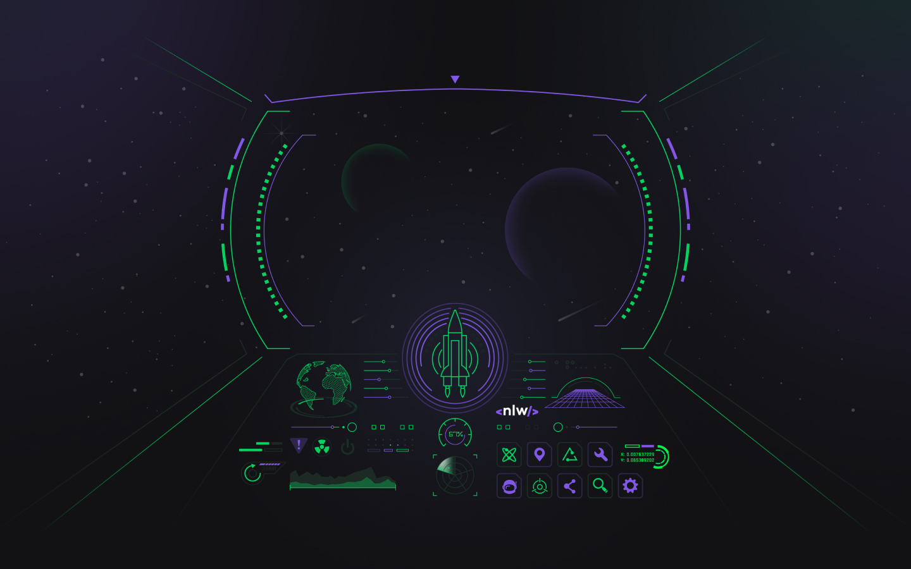
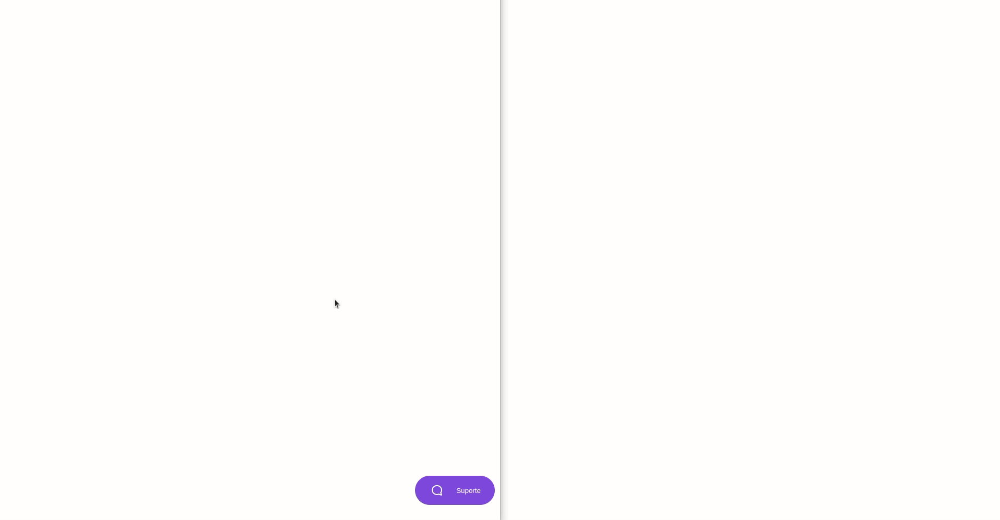

# Chatty APP

<p align="center">
  
  
  
  
</p>

<p align="center">
  <a href="#sobre">Sobre</a> •
  <a href="#chatty">Chatty</a> •
  <a href="#instalação">Instalação</a> •
  <a href="#tecnologias">Tecnologias</a> •
  <a href="#autor">Autor</a>  
</p>

## Sobre

Projeto desenvolvido durante a NLW V, evento criado pela Rocketseat. Um evento 100% online e GRATUITO, com conteúdo exclusivo e INÉDITO.

Ocorreu do dia 19 a 25 de Abril de 2021 e teve como intuito mostrar na prática o poder do NodeJS para construção de backends complexos e de alto nível.



## Chatty

O Chatty é uma aplicação web de chat para atendimento ao cliente em tempo real.

A aplicação funciona como um chat web aonde os clientes entram em contato com os administradores a fim de sanar duvidas, conceder feedbacks, fazer elogios e etc.

Vamos conhecer abaixo a aplicação da perspectiva dos clientes e dos administradores, respectivamente.

### Visualização - Cliente

Assim que o usuário acessa a página destinada à ele, irá se deparar com a tela abaixo. A tela não possui nada além do botão de suporte pois o propósito aqui é o chat de interação entre clientes e fornecedores.


Ao clicar no botão flutuante `Suporte`, a janela de criação de chat será exibida. É nela onde o usuário informará seu e-mail para identificação e deixará sua mensagem para os responsáveis:


Após informar os dados solicitados e iniciar o chat, a visualização da página será a seguinte:


Conforme visto acima, a mensagem já foi enviada e o chat criado, basta aguardar uma resposta de um dos administradores para iniciarem uma conversa síncrona, como podemos ver abaixo o usuário sendo respondido e recebendo a resposta em tempo real:


Veremos esse fluxo acontecendo desde o inicio no final do tópico da aplicação onde deixarei um GIF da aplicação em funcionamento.

### Visualização - Admin

Aos administradores, a homepage de gestão dos chats é basicamente uma lista com os atendimentos pendentes e o email do usuário de cada uma das solicitações:


Após clicar no botão `Entrar em atendimento`, a mensagem enviada pelo usuário em questão será exibida e eles poderão conversar a respeito do assunto iniciado pelo cliente:


Para ilustrar o fluxo da aplicação como um todo, deixo o GIF abaixo aonde navego por todas as partes da aplicação com a finalidade de demonstrar seu funcionamento:

> ℹ A tela da esquerda é o CLIENTE e a da direita a tela do ADMINISTRADOR.



## Instalação

Antes de começar, você vai precisar ter instalado em sua máquina as seguintes ferramentas:
[Git](https://git-scm.com) e [Node.js](https://nodejs.org/en/). Além disso é bom ter um editor para trabalhar com o código como [VSCode](https://code.visualstudio.com/).

### 🎲 Rodando o Back End (servidor)

```bash
# Clone este repositório
$ git clone git@github.com:MrRioja/chatty.git

# Acesse a pasta do projeto no terminal/cmd
$ cd chatty

# Instale as dependências
$ npm install
# Caso prefira usar o Yarn execute o comando abaixo
$ yarn

# Execute as migrations
$ yarn typeorm migration:run

# Execute a aplicação em modo de desenvolvimento
$ npm run dev
# Caso prefira usar o Yarn execute o comando abaixo
$ yarn dev

# Acessar o frontend como Cliente através desse URL:
# http://localhost:3333/pages/client
# Acessar o frontend como Administrador através desse URL:
# http://localhost:3333/pages/admin

# A API iniciará na porta 3333 - acesse <http://localhost:3333>
```

## Tecnologias


<br><br><br><br>

## Autor

<div align="center">

<h1>Luiz Rioja</h1>
<strong>Backend Developer</strong>
<br/>
<br/>

<a href="https://linkedin.com/in/luizrioja" target="_blank">

</a>

<a href="https://github.com/mrrioja" target="_blank">

</a>

<a href="mailto:lulyrioja@gmail.com?subject=Fala%20Dev" target="_blank">

</a>

<a href="https://api.whatsapp.com/send?phone=5511933572652" target="_blank">

</a>

<a href="https://join.skype.com/invite/tvBbOq03j5Uu" target="_blank">

</a>

<br/>
<br/>
</div>
